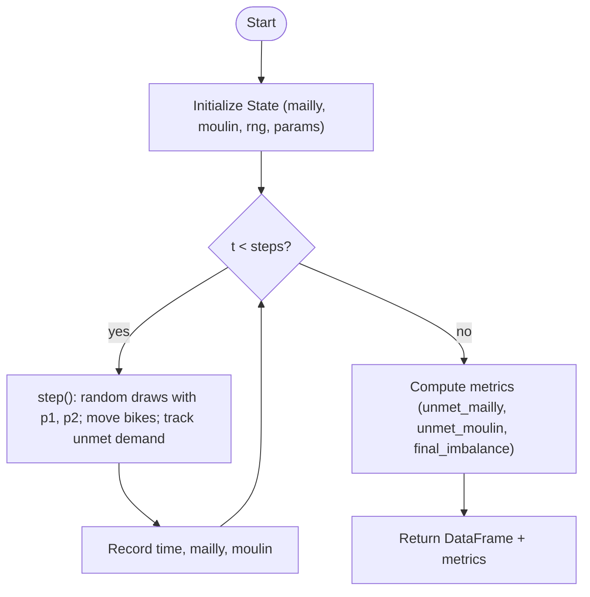
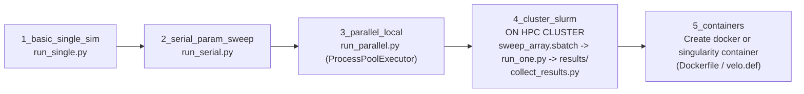

# Bike-Sharing Simulation: From Single Core to HPC

This repository contains a progressive series of exercises designed to teach computational methods and high-performance computing (HPC) concepts through a bike-sharing simulation model.

## Overview

You will implement a stochastic simulation of a bike-sharing system between two stations (Mailly and Moulin). The simulation models probabilistic bike movements and tracks various metrics like unmet demand and station imbalances.

## Learning Objectives

By completing these exercises, you will learn:

- **Stochastic simulation** fundamentals
- **Serial vs parallel** computation concepts
- **Local multiprocessing** with Python
- **HPC cluster computing** with SLURM
- **Containerization** for reproducible computing
- **Data aggregation** and visualization techniques

## Repository Structure

```text
├── 1_basic_single_sim/     # Single simulation run
├── 2_serial_param_sweep/   # Serial parameter sweeps
├── 3_parallel_local/       # Local parallel processing
├── 4_cluster_slurm/        # SLURM cluster execution
└── 5_containers/           # Container deployment
```

## Core Components

### State Model

- **State**: Tracks bike counts at Mailly and Moulin stations
- **step()**: Simulates one time step with probabilistic bike movements
- **run_simulation()**: Executes complete simulation and returns results

### Key Parameters

- `p1`: Probability of movement from Mailly → Moulin
- `p2`: Probability of movement from Moulin → Mailly
- `steps`: Number of simulation time steps
- `seed`: Random seed for reproducibility

## Visual Overview (Mermaid)

### Core simulation loop



### Project execution paths



## Implementation Guide

### Phase 1: Basic Simulation (1_basic_single_sim/)

**Implement:**

1. **`model.py`**:
   - `step()`: Handle probabilistic bike movements and track unmet demand
   - `run_simulation()`: Run simulation loop and collect timeseries data

2. **`run_single.py`**:
   - `parse_args()`: Parse command-line arguments
   - `main()`: Execute simulation and save results

**Test your implementation:**

```bash
cd 1_basic_single_sim/
python run_single.py --steps 100 --p1 0.3 --p2 0.2 --init-mailly 10 --init-moulin 5 --out-csv results.csv --plot
```

### Phase 2: Serial Parameter Sweep (2_serial_param_sweep/)

**Implement:**

1. **`model.py`**: Same as Phase 1
2. **`run_serial.py`**:
   - Process multiple parameter combinations from CSV
   - Aggregate results across runs
   - Generate comparative visualizations

**Test your implementation:**

```bash
cd 2_serial_param_sweep/
python run_serial.py --params params.csv --out-dir results/ --plot
```

### Phase 3: Local Parallel Processing (3_parallel_local/)

**Implement:**

1. **`model.py`**: Extended with unmet metrics
2. **`run_parallel.py`**:
   - `worker()`: Function for parallel execution
   - Use `ProcessPoolExecutor` for CPU-bound parallelization
   - Handle result collection from multiple processes

**Test your implementation:**

```bash
cd 3_parallel_local/
python run_parallel.py --params params.csv --out-dir results/ --workers 4 --plot
```

### Phase 4: Cluster Computing (4_cluster_slurm/)

**Implement:**

1. **`run_one.py`**: Execute single simulation from parameter file row
2. **`collect_results.py`**: Aggregate distributed results
3. **`sweep_array.sbatch`**: Configure SLURM array job

**Test your implementation:**

```bash
cd 4_cluster_slurm/
# Submit array job
sbatch sweep_array.sbatch
# After completion, collect results
python collect_results.py --in-dir results/ --out-dir aggregated/ --plot
```

### Phase 5: Containerization (5_containers/)

**Explore:**

- Container definitions for reproducible deployment
- Portable execution environments

## Expected Outputs

Each phase should produce:

- **Timeseries data**: CSV files with bike counts over time
- **Metrics**: Performance and behavior statistics
- **Visualizations**: Plots showing simulation results
- **Aggregated results**: Combined data from multiple runs

## Key Metrics Tracked

- `unmet_mailly`: Unmet demand at Mailly station
- `unmet_moulin`: Unmet demand at Moulin station
- `final_imbalance`: Final difference in bike counts between stations

## Development Tips

1. **Start simple**: Implement Phase 1 completely before moving to Phase 2
2. **Test incrementally**: Verify each function works before proceeding
3. **Use small parameters**: Test with small step counts initially
4. **Check data formats**: Ensure CSV outputs match expected structure
5. **Debug with prints**: Add logging to understand simulation behavior

## Common Implementation Patterns

### Random Number Generation

```python
rng = np.random.default_rng(seed)
if rng.random() < probability:
    # Execute action
```

### DataFrame Construction

```python
df = pd.DataFrame({
    "time": times,
    "mailly": mailly_counts,
    "moulin": moulin_counts
})
```

### Metrics Tracking

```python
metrics = {
    "unmet_mailly": 0,
    "unmet_moulin": 0,
    "final_imbalance": 0
}
```

## Troubleshooting

- **Import errors**: Ensure you're in the correct directory
- **Missing dependencies**: Install required packages (pandas, numpy, matplotlib)
- **File not found**: Check file paths and create output directories
- **SLURM issues**: Verify cluster access and module availability

## Dependencies

Required Python packages:

- `numpy`: Numerical computations and random number generation
- `pandas`: Data manipulation and CSV I/O
- `matplotlib`: Plotting and visualization
- `concurrent.futures`: Parallel processing (built-in)

Install with:

```bash
pip install numpy pandas matplotlib
```

## Getting Started

1. Clone this repository
2. Install dependencies
3. Start with Phase 1 (`1_basic_single_sim/`)
4. Read the docstrings carefully for implementation guidance
5. Test each function individually before integration
6. Progress through phases sequentially

Good luck with your implementation!
